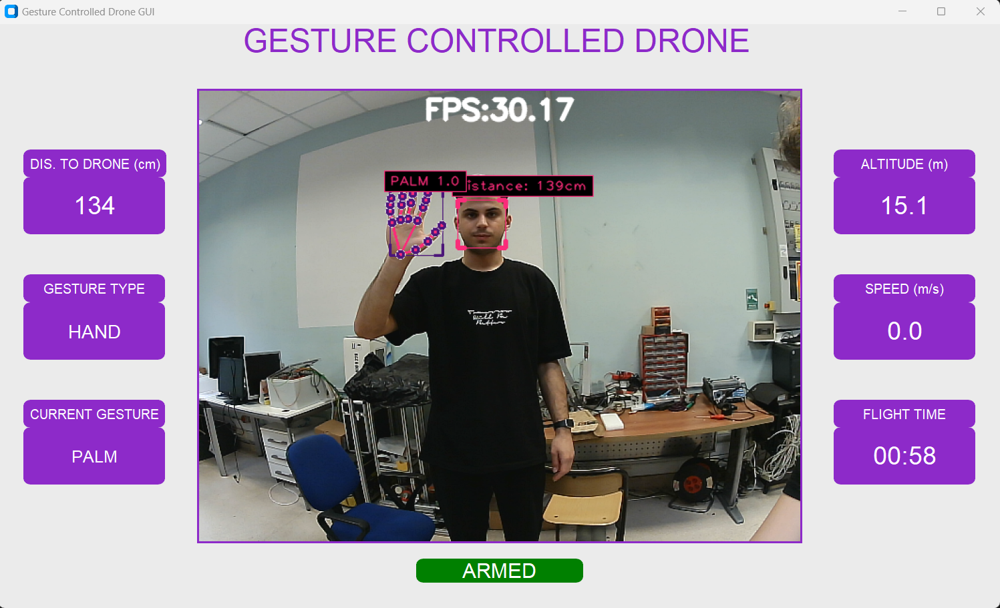

# Gesture Controlled Drone

This project enables the control of a drone using real-time hand and body gestures. The system utilizes computer vision to recognize gestures from a video feed and translates them into flight commands using DroneKit. It features a dual-mode control system that intelligently switches between hand and body gesture recognition based on the user's distance from the camera.

---

## Demo Video

Watch a demonstration of the project in action. Click the thumbnail below to see the drone being controlled by hand and body gestures in real-time.

[](https://www.youtube.com/watch?v=cUXDqCaNs9g&ab_channel=Emre%C3%87and%C4%B1r)

---

## Features

* **Dual-Mode Gesture Control**:

    * **Hand Gestures**: For close-range control.

    * **Body Gestures**: For long-range control. 

* **Automatic Mode Switching**: The system uses face detection to estimate the user's distance and automatically switches between hand and body gesture modes.

* **Real-time Recognition**: Utilizes MediaPipe for landmark detection and a custom-trained TensorFlow Lite model for fast and efficient gesture classification.

* **Comprehensive Drone Commands**: Control a wide range of movements (up, down, left, right, forward, backward) and actions (takeoff, land, photo, video record/pause, emergency). Follow and palm mode will be implemented.

* **Intuitive GUI**: A user-friendly interface built with CustomTkinter that displays:

    * Live video feed from the drone's camera.

    * Key flight telemetry: Altitude, Speed, Armed Status, and Flight Time.

    * Current gesture detection mode (Hand/Body) and the recognized command.

* **SITL/Hardware Support**: Easily configurable for use with a software-in-the-loop (SITL) simulator or a physical drone.

---

## Hardware Components

This system is designed to run entirely on the drone, using an onboard companion computer for all processing tasks.

* **Flight Controller**: *Pixhawk Cube Black*

* **Onboard Companion Computer**: *NVIDIA Jetson Nano* 

* **Camera**: *OV2710 USB camera*

---

## Project Structure 

```bash

gesture-controlled-drone/
├── assets/
├── model/
│   ├── body_detection/    # Body gesture model and labels
│   └── hand_detection/    # Hand gesture model and labels
├── notebooks/
│   ├── data_preprocessing.ipynb
│   ├── body_gesture_classifier.ipynb
│   └── hand_gesture_classifier.ipynb
├── utils/
│   ├── detectors.py
│   ├── distance_estimation.py
│   ├── drone_movement.py
│   ├── dronekit_func.py
│   ├── gui.py
│   ├── helper_func.py
│   └── image_processing.py
├── config.py              # Main configuration file
├── main_file.py           # Main application entry point
└── requirements.txt

```

---

## How It Works

1.  **Video Capture**: The main controller in `image_processing.py` captures the video feed from the onboard camera.

2.  **Distance Estimation**: The `detectors.py` module uses MediaPipe to detect a face in the frame, and `distance_estimation.py` calculates the distance to the user.

3.  **Mode Selection**: Based on the `GESTURE_SWITCH_DISTANCE` configured in `config.py`, the system selects either hand or body gesture detection mode.

4.  **Landmark Detection**: MediaPipe extracts key landmarks for the selected mode (e.g., hand or body pose landmarks).

5.  **Gesture Classification**: The extracted landmarks are pre-processed and fed into a TensorFlow Lite model (`.tflite`) which classifies the gesture and returns a command ID.

6.  **Command Execution**: The gesture ID is passed to `drone_movement.py`, which maps it to a specific function (e.g., `up()`, `land()`) and sends the corresponding MAVLink command to the drone via DroneKit.

7.  **GUI Updates**: The `gui.py` module, running in the main thread, continuously updates the video frame and status labels with the latest data from the drone.

---

## Setup and Installation

### 1. Clone the Repository

```bash

git clone https://github.com/emrecandir9/custom-gesture-dataset

cd gesture-controlled-drone

```

### 2. Create a Virtual Environment

```bash

# For Windows

python -m venv venv

venv\Scripts\activate

```

### 3. Install Dependencies

Install all the required Python libraries using the requirements.txt file.

```bash

pip install -r requirements.txt

```

### 4. Dataset and Models

The gesture recognition models in this project were trained on a custom dataset created specifically for this purpose. You can find the dataset, along with a tool for collecting your own data in the correct format, at the repository below:

* **Custom Gesture Dataset & Collector**: [https://github.com/emrecandir9/custom-gesture-dataset](https://github.com/emrecandir9/custom-gesture-dataset)

You have two options for the models:

* **Option A: Use the Provided Models**

    * The pre-trained TensorFlow Lite models (`hand_detection_model.tflite` and `body_detection_model.tflite`) are included in the `/model` directory and are ready for use.

* **Option B: Train Your Own Models**

    1.  **Data Collection & Preprocessing**:

        * Collect video files of your desired gestures. You can use the tool provided in the dataset repository linked above to ensure the data is in the required format.

        * Use the `data_preprocessing.ipynb` notebook in the `/notebooks` directory to process your videos. This notebook will extract the necessary landmarks using MediaPipe and generate the `keypoint.csv` files required for training.

    2.  **Model Training**:

        * Once your dataset is prepared, run the `hand_gesture_classifier.ipynb` and `body_gesture_classifier.ipynb` notebooks to train the models from scratch.

### 5. Configure the Application

Open `config.py` to adjust settings:

* **Drone Connection**: Set the `DRONEKIT_CONNECTION_STRING`. For a simulator like SITL, use `"tcp:127.0.0.1:5762"`. For a physical drone, use the appropriate port (e.g., `"dev/tty0"` ).

* **Thresholds**: You can modify detection confidence, gesture accuracy thresholds, and the distance for switching modes.

## Usage

Once the setup is complete, run the main application from the root directory:

```bash

python main_file.py

```

The GUI window will launch, displaying the camera feed and drone status.

## Screenshots 

Here is a look at the main Graphical User Interface (GUI) during operation.

  

## License

This project is licensed under the MIT License. See the LICENSE file for details.


